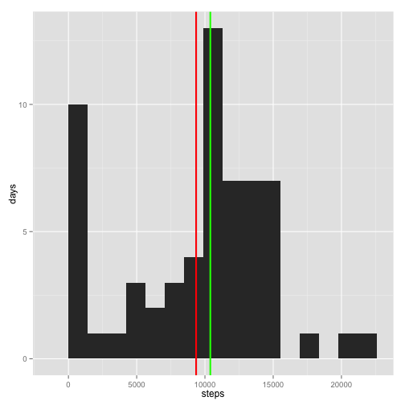

## Introduction

The "quantified self" movement provides individuals with the a wealth of data about their
own lives. In this report, we look at step count data, which has been quantified into 5 minute
intervals over several days.

## Loading and preprocessing the data

The data was provided in the file activity.csv.


```r
library(ggplot2)
act.d <- read.csv("activity.csv")

dat.interval.n <- length(act.d$interval)
dat.interval.r <- range(act.d$interval)
dat.date.n <- length(unique(act.d$date))
dat.date.r <- range(as.Date(act.d$date))
```

At this time we note, but do not correct, that some of the data is missing. We explore the data to understand the type and range of data.  We note that the data contains three columns: steps, date and interval. 

Their are 17568 values for the 5 minute intervals in the day and the range over 0, 2355. Therefore we see they are in the form hour*100+minute, the first interval is at 0 hours 0 minutes, and the final, 288-th interval, at 23 hours 55 minutes,.

The days are a consecutive sequence of 61 days ranging over 2012-10-01, 2012-11-30.

## What is mean total number of steps taken per day?

Our first exploration is a histrogram of the number of steps the subject takes each day.

We batch our data by date, and take the total number of steps each day. This is a statistical quantity of steps sampled over days.


```r
days <- unique(act.d$date)
c <- c()
for (d in days) {
	c <- c(c,sum(act.d[act.d$date==d,]$steps,na.rm=TRUE))
}
df<-data.frame(c)
df.c.mean <- mean(df$c)
df.c.median <- median(df$c)
```

We plot the resulting data set using a histogram.  marking byt blue and red lines, respectively the mean and median of the data set, indexed by days. The mean number of steps per day, averaged over days, is marked by a red  line at 9354.23, and the median is marked by a green line at 10395.


```r
g <- ggplot(df,aes(x=c)) 
g <- g + geom_histogram(binwidth=range(c)[2]/15) + xlab("steps") + ylab("days")
g <- g + geom_vline(xintercept=mean(df$c),color="red",size=1)
g <- g + geom_vline(xintercept=median(df$c),color="green",size=1)
g
```

 

## What is the average daily activity pattern?

We would like to understand the daily activity pattern. We consider an activity pattern to be the typically number of steps in an interval as the day proceeds. Therefore, we average each 5 minute interval across days, considering a day to be a random sample form the activity pattern distribution. We then plot them over the course of a day. 

Note that the code makes use of an important property of the data that there are consistently 288 intervals reported in a day, and that they are reported in the same order for each day. To simplify the coding, non-available data items are set to zero. We shall return to this issue later in the report.


```r
steps.na <- is.na(act.d$steps)
act.d[steps.na,]$steps <- 0
len <- length(act.d[act.d$date==days[1],]$steps)
a <- integer(length=len)
for (d in days) {
	a = a + act.d[act.d$date==d,]$steps
}
a <- a / length(days)
df<-data.frame(x=1:len,y=a)

step.max <- which.max(a)
time.max <- act.d$interval[step.max]
time.minute <- time.max %% 100
time.hour <- time.max %/% 100

g <- ggplot(df,aes(x=x,y=y))
g <- g + geom_line() + xlab("5 minute interval") + ylab("steps")
g
```

 

The 5-minute interval at which the maximum is achieved is 8:35.


## Inputing missing values

We return now to the issue of missing data points. These are of the form of missing step counts for a particular 5 minute interval. The total number of missing datapoints is 2304, out of 
a total of 17568 datapoints. That is, about 
13.11% of the
data is missing.

Our analysis up to this point have set these points to zero, or have effectively ignored them. We have various options to account for these missing points, but it seems reasonable to substitue a typical quantity, inferred from the rest of the data set, for the missing point. We have now a sample average for each 5 minute interval, treating each day as an unweighted and unbiased sample from among the daily patterns. We will use the 5 minute interval averaged over the days as a substitute for a missing data point.


```r
for (d in days) {
	act.d[act.d$date==d,]$steps <- ifelse(steps.na[act.d$date==d],a,act.d[act.d$date==d,]$step)
}
c <- c()
for (d in days) {
	c <- c(c,sum(act.d[act.d$date==d,]$steps))
}
df<-data.frame(c)
```

Having made this substitution, we plot a new histogram to see if there is any change. And indeed there is a new mean and median, as indicated on the histogram.


```r
g <- ggplot(df,aes(x=c)) 
g <- g + geom_histogram(binwidth=range(c)[2]/15) + xlab("steps") + ylab("days")
g <- g + geom_vline(xintercept=mean(df$c),color="red",size=1)
g <- g + geom_vline(xintercept=median(df$c),color="green",size=1)
g
```

 

```r
print(sprintf("mean = %f, median %f",mean(c),median(c)))
```

```
## [1] "mean = 10581.013706, median 10395.000000"
```

It is understandable that raising zero values to the average will raise the new average, but not so much as the place the zeros beyond the middle value, hence the median is unchanged.

## Are there differences in activity patterns between weekdays and weekends?

It is very natural to wonder if daily activity patterns is not uniform by days, and the most natural distinction is weekdays versus weekends. We therefore segment the data into these two categories and rerun the averaging for each category separately.

As a techincal aside, the inference of day of week from date is complicated. We definte a predicate, is.weekend, that takes care of the details.


```r
is.weekend <- function(d) {
	da <- weekdays(as.Date(d),abbreviate=TRUE)
	r <- FALSE
	if (da=="Sat" | da=="Sun")  {
		r <- TRUE
	} 
	r
}

a.wd <- integer(length=len)
a.wd.n <- 0
a.we <- integer(length=len)
a.we.n <- 0
for (d in days) {
	if (is.weekend(d)) {
		a.we <- a.we + act.d[act.d$date==d,]$steps
		a.we.n <- a.we.n + 1
	}
	else {
		a.wd <- a.wd + act.d[act.d$date==d,]$steps	
		a.wd.n <- a.wd.n +1 
	}
	
}
a.wd <- a.wd / a.wd.n
a.we <- a.we / a.we.n
```

To create the plots, we combine the weekend and weekday data into a single frame, using a new facet column to mark which data has been combined. We can then use R's faceting capabilities to join them into a gridded plot. This is a bit of data manipulation made easy by R.


```r
df<-data.frame(x=c(1:len,1:len),y=c(a.wd,a.we),facet=c(rep("weekday",len),rep("weekend",len)))
g <- ggplot(df,aes(x=x,y=y))
g <- g + geom_line() + xlab("5 minute interval") + ylab("steps")
g <- g + facet_grid(facet ~ .)
g
```

 

We note the following:

* The overall pattern of activity is similar between weekends and weekdays.
* Peak activity is noticably higher on weekdays.
* Weekday activity starts earlier, up until about 8 o'clock.
* Weekday activity has an additional late night peak.
* Otherwise weekend activity extends higher into the later hours.


